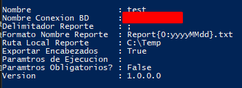
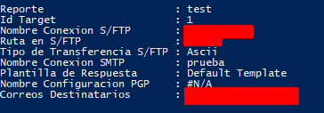
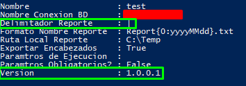
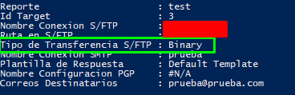

# PSReports


PSReports es un modulo de Powershell que permite la generacion de reportes a partir de la configuracion de un script de SQL.

### Crear Una Nueva Configuracion Para Un Reporte

**1. Crear Target**

El target o targets son los diferentes destinos que tendra el reporte generado y si este sera o no encriptado para cada target.
- **Nota** 
Las llaves indicadas en la configuracion son previamente creadas en [PSProcessa](https://github.com/RD-Processa/PSProcessa/tree/master/scripting/getting-started/mailbox) utilizando las funciones de Set-SMTPConnection, Set-FTPConnection y Set-PGPKeyStore

```powershell
Get-FTPConnection
# Uno de los Nombres retornados por la anterior funcion debe ser colocado en la variable $FtpKey

Get-SmtpConnection
# Uno de los Nombres retornados por la anterior funcion debe ser colocado en la variable $Smtpkey

Get-PGPKeyStore
# Uno de los Nombres retornados por la anterior funcion debe ser colocado en la variable $PGPKey

$TargetA = New-Target -FtpKey $FtpKey -RemotePath $RemotePath -TransferMode Ascii -SmtpKey $Smtpkey -EmailTo $EmailTo
$TargetB = New-Target -FtpKey $FtpKey -RemotePath $RemotePath -TransferMode Binary -SmtpKey $Smtpkey -EmailTo $EmailTo -PGPKey $PGPKey
```

**2. Crear Configuracion Del Reporte**

La configuracion del reporte recibe un array de objetos (Targets) como uno de sus parametros de entrada, este puede ser recibido por pipeline "|".
- **Nota**
La llave indicada en el parametro SqlKey debe estar previamente creada en PSPRocessa utilizando la funcion Sqt-SqlConnection

```powershell
Get-SqlConnection 
# Uno de los Nombres retornados por la anterior funcion debe ser colocado en la variable $SqlKey

$TargetA | New-Report -Name $ReportName -SqlPath $DirectorySqlPath -SqlKey $SqlKey -OutputPath $OutputPath -Delimiter ';' -FileNameFormat 'Report{0:yyyyMMdd}.txt' -ExportHeader
$TargetA,$TargetB | New-Report -Name $ReportName2 -SqlPath $DirectorySqlPath2 -SqlKey $SqlKey2 -OutputPath $OutputPath -FileNameScript {'Report{0:yyyyMMdd}.txt' -f (Get-Date).AddDays(-2)} 
```

**3. Obtener Configuracion Del Reporte**

Para obtener la configuracion creada previamente utilizaremos los siguientes comandos:
```powershell
Get-Report 
# Este primer comando nos retornara todas las configuraciones creadas
Get-Report -Name $ReportName 
# Este comando nos retornara la configuracion creada del reporte con el nombre que se encuentre en la variable $ReportName 
Get-Report -Name $ReportName | Get-Target 
# Este comando nos retornara los diferentes target que tenga asociado el reporte con el nombre que se encuentre en la variable $ReportName 
```
<h2 align="center"> <br> </h2>

### Ejecutar Un Reporte

Para ejecutar un reporte es necesario utilizar la funcion Get-Report ya que el objeto de salida de esta funcion se utiliza como parametro de entrada para la funcion Invoke-Report.

```powershell
    Get-Report -Name $ReportName | Invoke-Report
```

- **Nota**
Los logs del proceso se encontraran en las carpetas del modulo PSReports (ReportLogs).

### Actualizar La Configuracion De Un Reporte 

Para realizar la actualizacion de la configuracion de un reporte se debera utilizar el siguiente comando 

```powershell
    Get-Report -Name $ReportName | Update-Report -Delimiter '|' -SqlPath $NewDirectorySqlPath
```
- **Nota**
Este comando generara una nueva version de la configuracion del reporte y almacenara la configuracion anterior. Para obtener la configuracion anterior sera necesario ejecutar el comando
```powershell
    Get-Report -Name $ReportName -Version 1.0.0.0
```
<h2 align="center"></h2>

### Actualizar Un Target 

```powershell
    Get-Report -Name $ReportName | Get-target -IdTarget 1 | Update-Target -EmailTo $NewEmailTo
```
- **Nota**
Este comando actualiza el target y genera una nueva version de la configuracion del reporte.

<h2 align="center"></h2>

## Estructura de la documentación

Las carpetas corresponden a los siguientes recursos de información:

| Carpeta  | Descripción  |
|:---|---|
| [Scripting >> Setup](Scripting/Setup)  | Describe el proceso de instalación del módulo |
| [Scripting >> Functions](Scripting/Functions)  | Funciones del modulo para manipulacion de la configuracion y ejecucion del reporte. |
